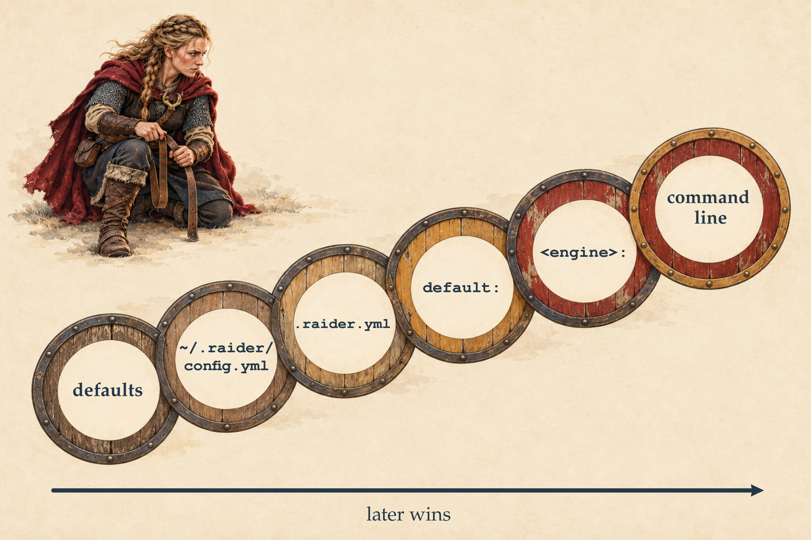

# Langertha::Raider


The autonomous agent engine of [Langertha](https://metacpan.org/dist/Langertha)
(`Langertha::Raider`, plus the `Langertha::Raid` orchestration layer) together with
the `raider` command-line agent built on it (`Langertha::Raider::CLI`).

`raider` is an autonomous command-line agent in Perl. It wraps `Langertha::Raider`
with a practical toolbox — filesystem, bash, web search, web fetch, optional
Perl-native tools — and drops you into a REPL (or a one-shot run) where a viking
shield-maiden named **Langertha** does the work, against any of the ten LLM
providers `-e` knows (from Perl, `Langertha::Raider` takes any Langertha engine).

```
             __     __
.----.---.-.|__|.--|  |.-----.----.
|   _|  _  ||  ||  _  ||  -__|   _|
|__| |___._||__||_____||_____|__|
 perl agent - powered by Langertha
```

> This README describes what `raider` **does today**. The wider vision — the
> home-directory assistant, provider discovery, delegates, reviewed long-term
> memory, editor integration over stdio — lives in
> [`CONTEXT.md`](CONTEXT.md) and the ADRs under [`docs/adr/`](docs/adr/), and is
> collected under [Roadmap / Planned](#roadmap--planned) below so you can tell
> the two apart.

## One tool, two jobs

Raider is designed to be two things from one kernel: a **project agent** that works
inside a directory (like Claude Code), and a personal **assistant** that lives in
your home and is reachable everywhere (like a Hermes agent).

Today the **project-agent** side is what ships: you run `raider` in a project, it
reads that project's instructions and tools, and records its work in per-project
sessions. The **assistant** side (the `~/.raider/` home profile, reviewed long-term
memory, home-mounted services) is largely on the [roadmap](#roadmap--planned); the
Hall already covers the always-reachable, long-lived, Telegram/cron part of it.

## Quick start

From CPAN:

```bash
cpanm Langertha::Raider
export ANTHROPIC_API_KEY=...     # or OPENAI_API_KEY, GROQ_API_KEY, ...
cd ~/dev/my-project
raider                           # REPL opens in the current directory
```

From a git checkout:

```bash
cpanm --installdeps .
perl -Ilib bin/raider
```

Or as a single-file Linux binary — no Perl needed (see [Binary](#binary-no-perl-needed)).

Or via Docker — no Perl toolchain required (see [Docker](#docker)):

```bash
docker run --rm -it -v "$PWD:/work" -e ANTHROPIC_API_KEY raudssus/raider
```

Then tell Langertha what to do:

```
raider> lies die Changes und schreib mir ne kurze summary
raider> such im web nach "Perl 5.40 release notes", dann hol den ersten treffer
raider> prove -l t/ laufen, falls was rot ist report zurück
```

One-shot usage (no REPL):

```bash
raider "check git status and summarize"
raider --json "count the .pm files in lib" | jq .
```

When stdin is a terminal and you give no prompt on the command line, `raider` drops
into the REPL automatically. With [`Term::ReadLine::Gnu`](https://metacpan.org/pod/Term::ReadLine::Gnu)
installed, line editing and persistent input history (`~/.raider_history`) are on.

## How it picks an engine

Zero configuration: the first `*_API_KEY` found in the environment decides the
engine (in the order below), and a cheap model is used by default.

| Engine     | Env var                              | Default model             |
|------------|--------------------------------------|---------------------------|
| anthropic  | `ANTHROPIC_API_KEY`                  | `claude-haiku-4-5`        |
| openai     | `OPENAI_API_KEY`                     | `gpt-4o-mini`             |
| deepseek   | `DEEPSEEK_API_KEY`                   | `deepseek-chat`           |
| groq       | `GROQ_API_KEY`                       | `llama-3.3-70b-versatile` |
| mistral    | `MISTRAL_API_KEY`                    | `mistral-small-latest`    |
| gemini     | `GEMINI_API_KEY`                     | `gemini-2.5-flash`        |
| minimax    | `MINIMAX_API_KEY`                    | `MiniMax-M3`              |
| cerebras   | `CEREBRAS_API_KEY`                   | `llama3.1-8b`             |
| openrouter | `OPENROUTER_API_KEY`                 | *(set `-m`)*              |
| ollama     | *(none — local)*                     | `llama3.3`                |

Auto-detection tries `anthropic`, `openai`, `deepseek`, `groq`, `mistral`, `gemini`
in that order, and falls back to `anthropic`. Override with `-e <engine>`,
`-m <model>` or `-k <key>`.

`raider` uses provider API keys only. Claude Code subscription / OAuth credentials
from `~/.claude` are not read or reused as Anthropic API credentials.

## Commands and options

```
raider [options] [prompt...]        run a prompt (or open the REPL)
raider config explain [options]     show each effective setting and its source
raider config migrate [--dry-run]   move .raider.yml / .raider.md into .raider/
raider session list | show | resume | fork | rm     see Sessions
raider provider inspect HOST        show a provider's manifest, see Providers
raider --provider HOST [options]    run on a provider's manifest endpoint, see Providers
raider hall <subcommand>            the optional Raider Hall daemon
raider acp <subcommand>             the bundled ACP client
```

Options:

```
  -e, --engine NAME        anthropic, openai, deepseek, groq, mistral, gemini,
                           minimax, cerebras, openrouter, ollama (default: auto)
  -m, --model NAME         Model identifier (engine-specific cheap default)
  -k, --api-key KEY        API key (overrides *_API_KEY env var)
  -o, --option KEY=VALUE   Engine attribute (repeatable), e.g. -o temperature=0.2;
                           raider's own config keys (perl, packs=a,b, ...)
                           configure raider instead
  -r, --root DIR           Working directory (default: cwd). File tools are
                           confined to this directory.
  -M, --mission TEXT       Replace the persona and the instructions file
                           (.raider/instructions.md, else .raider.md; skills,
                           packs and the tool descriptions still apply)
      --bare               Isolated context: no instructions file, skills,
                           packs:, default packs or detection (--pack NAME and
                           /pack NAME still work)
  -i, --interactive        REPL mode (default on a TTY with no prompt / pipe)
      --json[=N]           Print one JSON document for the run and exit
      --msgpack[=N]        The same document as MessagePack
      --yaml[=N]           The same document as YAML
      --stream-json[=N]    Print the run as JSON Lines events as it happens
      --stream-msgpack[=N] The same events as MessagePack objects
      --stream-yaml[=N]    The same events as YAML documents
      --no-session         Do not record the run(s) in a session journal
      --session ID         Continue session ID (replay + record)
      --continue           The same, with the newest session of the project
      --max-iterations N   Hard safety cap on tool rounds per raid (default 10000)
      --no-color           Disable ANSI colors
      --no-trace           Hide live tool-call progress output (--trace shows
                           it, also with a machine flag, on stderr)
      --perl               Enable perl_eval / perl_check / perl_cpanm tools
      --pack NAME          Enable a bundled pack (repeatable)
      --no-pack NAME       Switch a pack off (also a detected/default one)
      --no-detect          Do not activate packs by workspace detection
                           (--detect forces it on over detect: false)
      --claude             Load CLAUDE.md + .claude/skills/*/SKILL.md
      --openai / --codex   Load AGENTS.md
      --skills DIR         Load *.md from DIR as skills (repeatable)
      --customize-prompt   Launch the prompt-builder at startup
      --export-skill [PATH]        Write a "how to use raider" markdown doc, exit
      --export-claude-skill [PATH] Write a Claude Code SKILL.md, exit
      --version            Print raider's and Langertha's version, exit
  -h, --help               Show help
```

REPL slash commands:

| Command                | Does                                                |
|------------------------|-----------------------------------------------------|
| `/help`                | Command list                                        |
| `/clear`               | Reset conversation history and token counters       |
| `/metrics`             | Cumulative raid metrics                             |
| `/stats`               | Tokens in / out / total (when trace is on)          |
| `/reload`              | Re-read the instructions file, re-detect packs      |
| `/prompt`              | Launch the prompt-builder (edits the instructions)  |
| `/skill [PATH]`        | Export the plain-markdown how-to-use doc            |
| `/skill-claude [PATH]` | Export a Claude Code `SKILL.md` with frontmatter    |
| `/config`              | Show each setting and where it came from            |
| `/model [NAME]`        | Show or save the model for the next run             |
| `/model list [FILTER]` | List models reported by the active engine           |
| `/packs`               | List available packs and whether they are active    |
| `/pack on/off NAME`    | Enable or disable a pack (`/pack NAME` toggles)     |
| `!CMD`                 | Run `CMD` in the shell only; nothing goes to the model |
| `?CMD`                 | Run `CMD`, then send it, its exit status and output to the model |
| `/quit` `/exit` `:q`   | Leave                                               |

`!CMD` and `?CMD` run `CMD` with `$SHELL -c` (`/bin/sh` without `SHELL`) in the working
root, and Ctrl-C ends the command, not raider. `!CMD` has the terminal, so `less` or
`vim` work, and stays out of the conversation and the session. `?CMD` shows the output as
it comes and then sends the command, its exit status and the output (stdout and stderr,
head and tail of anything past 20000 characters) to the model as your next prompt; a
command you end with Ctrl-C sends nothing. A line that is only `!` or `?` is a prompt.

`/pack` and `/reload` rebuild the mission, and mount or unmount the Perl tools when
a pack that requests them (the `perl` pack) comes or goes — the tools the model is
told about are always the tools it gets.

Full detail — every option, the environment variables, the machine-output document
schema and every exit status — is in `perldoc raider`.

## Configuration — `.raider/config.yml` or `.raider.yml`

Configuration is per-project: `.raider/config.yml` in the working root, or else the
legacy `.raider.yml` there, over the home file `~/.raider/config.yml` (see
[Roadmap](#roadmap--planned) for the rest of the planned `~/.raider/` home model).
All take the same keys; below, `.raider.yml` stands for
whichever file is in use. When both exist, only `.raider/config.yml` is read —
raider warns that it ignores `.raider.yml`, and `raider config explain` shows the
conflict. What raider saves (`/model`, `--claude`, `--openai`, `--skills`) goes to
the file in use, and to `.raider.yml` when there is none. It is read in layers,
later ones winning:



1. built-in defaults
2. `~/.raider/config.yml` (the same three layers as 3–5)
3. `.raider.yml` top-level keys
4. `.raider.yml` `default:` section
5. `.raider.yml` `<engine>:` section (`openai:`, `anthropic:`, ...)
6. command-line `-o` / flags

A project value replaces a home value, with three exceptions: `skills` and
`no_detect` from both files add up, and `detect:` rules are replaced per pack.
raider never writes the home file; run in `~` itself, `~/.raider/config.yml` is the
project file and is read once. `raider config explain` names home values `home`
(`home default:`, `home openai:`) and prints the home file's path.

`project_tools` in `~/.raider/config.yml` maps a workspace selector — `"*"`, a path
glob starting with `/` or `~/` (`*` stays within one directory, `**` crosses them),
or a workspace name — to the home tools a project gets; all matching entries add up.
Only the home file grants: a `project_tools` in a project file is ignored and
reported. For now `raider config explain` only shows which selectors match and
which tools they grant (and which packs request them); nothing is mounted from it
yet, and workspace names never match.

```yaml
# ~/.raider/config.yml
project_tools:
  "*": [telegram]
  "~/dev/**": [perl]
```

Flat form, or per-engine with a shared `default:` layer:

```yaml
# .raider.yml
default:
  temperature: 0.3
anthropic:
  temperature: 0.7
  response_size: 8192
openai:
  temperature: 0.5
```

Two kinds of keys live in the file:

- **Engine attributes** (`temperature`, `response_size`, `seed`, `model`, ...) go to
  the engine constructor. `-o key=value` on the command line overrides them (values
  are auto-coerced: `0.2` → Float, `4096` → Int, `true`/`false` → 1/0).
- **Raider's own keys** — `engine`, `perl`, `packs`, `skills`, `detect`,
  `no_detect`, `preferred_lib_target`, `project_tools` (home file only) — configure
  raider itself and never reach the engine. `skills` is merged across layers instead
  of replaced.

A file that does not parse, whose top level is not a mapping, or that puts a mapping
under one of raider's own keys (other than `skills`, `project_tools` and `detect`,
whose `detect:` map holds per-pack detection rules) is a hard error naming the offending key —
raider stops instead of loading half of it.

`.raider/instructions.md` in the working root — or the legacy `.raider.md` there —
is the **persona / mission** file: drop one in to rename Langertha, reshape her, or
replace her entirely; `/prompt` builds one interactively (in the file in use, else
`.raider.md`) and `/reload` hot-swaps it. With both present only
`.raider/instructions.md` is read; raider warns about `.raider.md` and
`raider config explain` lists it as ignored. `-M TEXT` replaces the instructions for
one run without touching the file.

To see where every effective value came from — a flag, a `.raider.yml` layer, an
environment variable or the built-in default — without writing anything or calling a
model:

```bash
raider config explain            # or /config inside the REPL
raider -e openai config explain  # options may come first
```

To move a project to the new layout, `raider config migrate` turns `.raider.yml` into
`.raider/config.yml` and `.raider.md` into `.raider/instructions.md` (each only if it
exists) and shows what it does first; `--dry-run` stops there. The new files are
written atomically, the legacy ones are renamed to `.raider.yml.bak` / `.raider.md.bak`,
and `.raider/` gets its `.gitignore` — afterwards `raider config explain` shows the
same settings from the new files. An `api_key` is **not** copied into
`.raider/config.yml`, which is meant to be committed: it is reported (never printed),
move it to `~/.raider/config.yml` or the engine's `*_API_KEY` variable. Nothing is
merged — if a new file or a backup already exists, nothing is written.

```bash
raider config migrate --dry-run  # show what would happen
raider config migrate -r ~/dev/app
```

## Sessions

Every run is recorded in a session journal (JSONL) under the working directory:
`.raider/sessions/<id>.jsonl`, one JSON object per line. A one-shot run starts a new
session and names it on stderr; the REPL starts one with its first prompt.
`--no-session` records nothing. Creating `.raider/` also writes a `.raider/.gitignore`
that excludes `sessions/` and `lib/` — a journal holds the full output of every tool,
so it is not committed by default. API keys never enter it.

```bash
raider session list                  # the project's sessions, newest first
raider session show ID               # one session, event by event
raider session show ID --json        # the whole journal as one document
raider session resume ID             # the REPL, continuing session ID
raider --session ID "and now ..."    # one more run in session ID
raider --continue "and now ..."      # the same, newest session
raider -i --continue                 # the REPL on the newest session
raider session fork ID               # a new session with ID's history
raider session rm ID                 # delete session ID
```

A session ID can be shortened to a unique start of it (`20260925-08`) or its last
four hex digits (`3f2a`); an ambiguous form is refused with the candidates listed.

One session has one writer at a time: while a raider writes a session it holds a
lock, and a second writer fails at once (exit status `4`) instead of waiting.
Continuing a session replays the conversation — nothing recorded is executed again —
and reports what the crash rules found: damaged lines, runs that never ended
(counted as `interrupted`), and tool calls without a result, whose outcome is
`unknown` and which are **never** re-run.

## Providers

A provider can describe itself in a manifest at `/.well-known/langertha.json`
(ADR 0007; schema and validator in Langertha core, `Langertha::Manifest`): its
endpoints with their wire dialect, the auth mechanism each needs, and its models
with the capabilities they claim. `raider provider inspect` fetches one, validates it
and shows it:

```bash
raider provider inspect provider.example             # HOST, HOST:PORT or an https origin
raider provider inspect provider.example --json      # one versioned document
raider provider inspect knarr.lan:8443 --allow-internal
```

It prints the provider id, the issuer, every endpoint (id, dialect, base URL, auth
reference), the auth entries (id, type) and the models (id, endpoint, claimed
capabilities), then warns about what this raider cannot use — a dialect it has no
adapter for, an auth type it cannot supply, a capability Langertha does not know
(treated as absent) — and notes that `extensions` are inert. A manifest carrying a
command, code, secret or prompt field is rejected as invalid.

Inspecting stores nothing, binds no credential and sends none: the fetch is https
only, at most 1 MiB, 10 seconds and 3 redirects within the origin; a redirect to
another origin is not followed but reported. The host is resolved once and every
address is checked, and the request goes to a checked address (TLS still verifies
the host name). Loopback, private, link-local and reserved addresses are refused
unless `--allow-internal` releases them for a knarr or skeid you run yourself; cloud
metadata, multicast and unspecified addresses are refused always.

`raider --provider HOST` runs on the endpoint a manifest declares, for one run and
with nothing stored — naming the host on the command line is the whole release, as
with `-o url=`:

```bash
raider --provider provider.example -m example-model -k "$KEY" "Summarize README.md"
raider --provider knarr.lan:8443 --allow-internal -k "$KEY"      # the REPL
```

The rules are provisional:

- **Model**: `-m` must be a model id of the manifest; without it the manifest must
  list exactly one. `model:` in `.raider.yml` does not apply.
- **Engine**: from the endpoint's dialect — `openai-chat` runs as `openai`,
  `anthropic`, `gemini` and `ollama` as themselves, `responses`, `perplexity-agent`,
  `anthropic-compat` (without native structured output) and `aki` on their own
  Langertha engines, with the endpoint's `base_url` as URL. An unknown dialect is an
  error, never a guess; so is `lmstudio` (Langertha's native LM Studio engine has no
  tool calling). Other `.raider.yml` and `-o` engine options apply as with `-e`;
  `-e`, `-o engine=` and `-o url=` are refused next to `--provider`.
- **Key**: only `-k` (or `-o api_key=`), never `.raider.yml` or an environment
  variable, so a key meant for another provider never reaches this one. An endpoint
  with an auth reference needs one; an endpoint without auth gets none.
- **Origin**: the endpoint must be `https` and of the manifest's own origin, and its
  host is checked again under the address rules above (`--allow-internal` releases
  both). The engine connects to the first checked address, not to a new lookup of
  the name (TLS still verifies the host name), so a DNS answer that changes after
  the check cannot send the key elsewhere. Model requests are POSTs and are not
  redirected; the engine's other requests follow no redirect.
- A model that does not declare `tools_native` is a warning, not an error.

`raider provider add` with a stored alias and credential is still planned (see
Roadmap).

## Tools

Every run assembles one toolbox, and the tool list in the model's prompt is
generated from exactly the tools the engine is offered — a tool that is not mounted
is not described. The built-ins:

| Tool                                                        | Notes                                     |
|-------------------------------------------------------------|-------------------------------------------|
| `list_files(path)`                                          | Directory listing, dirs suffixed with `/` |
| `read_file(path)`                                           | Full text file                            |
| `write_file(path, content)`                                 | Creates parents, overwrites               |
| `edit_file(path, old_string, new_string)`                   | Exact unique-match substitution           |
| `bash(command, [compress], [timeout], [working_directory])` | Real shell; stdout/stderr/exit code       |
| `web_search(query, [limit])`                                | Multi-provider, rank-fused                |
| `web_fetch(url, [as_html])`                                 | HTML flattened to text by default         |

Filesystem tools are confined to the `-r`/`--root` directory. `bash` starts there
(120 s per command unless the call sets `timeout`; `compress` shortens the output
for the model) but is a full shell, not confined to it. `web_search` always has
DuckDuckGo (keyless); Brave, Serper and Google are added automatically when
`BRAVE_API_KEY`, `SERPER_API_KEY`, or both `GOOGLE_API_KEY` + `GOOGLE_CSE_ID` are
set.

A raider started by the [Hall](#raider-hall) also gets `telegram_reply(bot, chat_id,
text, [message_thread_id])` (bound to the chat of a Telegram mission, where only
`text` is needed), `hall_status()` and `hall_spawn(name, mission)`.

`raider config explain` says whether the Perl tools are mounted and why;
`--export-skill` writes the current tool list as a table. You can add MCP tools
from Perl (see [Using the engine from Perl](#using-the-engine-from-perl)). A
fine-grained permission/policy layer over these tools is on the
[roadmap](#roadmap--planned); today the file-tool confinement above is the only
boundary.

### Perl-native tools

Three more tools come with `--perl`, with `perl: true` in `.raider.yml`, or — when
neither says otherwise — with an active pack that requests them: the bundled `perl`
pack, detected in a Perl workspace. `perl: false` keeps them off.

| Tool                                  | Notes                                          |
|---------------------------------------|------------------------------------------------|
| `perl_eval(code, [stdin], [timeout])` | Fresh interpreter per call; stdout/stderr/exit |
| `perl_check(code)`                    | `perl -c` — syntax check                       |
| `perl_cpanm(module, [options])`       | Install into the raider's private `local::lib` |

Installs land in a `local::lib` the raider owns — `.raider/lib/` in the working
directory by default (`preferred_lib_target` in `.raider.yml` moves it) — which is on
`PERL5LIB` of every `perl_eval` and `perl_check`, so freshly-installed modules are
visible to the next call without a restart. `perl_eval` also auto-recovers from
`Can't locate X/Y.pm in @INC`: it installs the missing module once, retries the
eval, and reports what it installed. It never loops. (Note that `perl -c` runs
`BEGIN`/`use`, so `perl_check` is code execution too.)

## Personas, packs and skills

- A **persona** is tone and style; the default is Langertha in a terse "caveman"
  register. Replace it with a `.raider/instructions.md` (or `.raider.md`) file or
  `-M`.
- A **pack** is a small, toggleable bundle (a `SKILL.md` plus an optional `pack.yml`)
  stacked on top of the mission. Bundled packs: **caveman**, **polite**, **teacher**
  (persona group, one active at a time) and **git-guru**, **testing-fu**,
  **perl-hacker**, **perl** (power group, stackable). Enable with `--pack NAME`,
  toggle in the REPL with `/pack`, persist under `packs:` in `.raider.yml`. Your
  own packs go into `.raider/packs/<name>/` of the project, `~/.raider/packs/<name>/`
  or a directory listed in `RAIDER_PACK_DIRS`; a `pack.yml` may set
  `exclusive_group`, `enabled_by_default`, `tools: [perl]` and a `detect:` rule.
- A **skill** is know-how — instructions and maybe resources — loaded into the
  mission. `--claude` loads `CLAUDE.md` and `.claude/skills/*/SKILL.md`,
  `--openai`/`--codex` loads `AGENTS.md`, and `--skills DIR` loads plain markdown
  from a directory. These persist to `.raider.yml` on first use (the banner shows
  `(saved)`), so they load automatically next time.

Packs can also **activate by workspace detection** (ADR 0012): the bundled `perl`
pack turns its Perl tools on when it detects a Perl workspace (`cpanfile`,
`dist.ini`, `Makefile.PL` or `lib/**/*.pm`). `--no-detect` / `detect: false` turns
detection off; `raider config explain` shows what activated and why.

## Machine interface

For scripting, six mutually-exclusive flags replace the human output with one
format-independent model, written in three encodings:

- `--json` / `--msgpack` / `--yaml` — one document, printed once when the run ends.
- `--stream-json` / `--stream-msgpack` / `--stream-yaml` — an event stream
  (`run.started`, `tool.call`, `tool.result`, `message`, ...), the last event
  (`run.finished`) carrying that same document.

The document is versioned (`--json=N`; version `1` is the only one), and within a
version fields are only ever added — a consumer must ignore fields it does not know.
With a machine flag, stdout carries only the machine output; the live trace, if
asked for, goes to stderr. Exit status distinguishes success (`0`), a failed run
(`1`), usage errors (`2`), configuration errors (`3`), a session in use (`4`) and
signal cancellation/interruption (`130`/`143`). The full schema is in
`perldoc raider` (ADR 0013).

## Raider Hall

You don't need a daemon to use Raider. **Raider Hall** is the optional daemon for
being reachable: it runs raiders on demand, on cron, on a Telegram message, or over
the Agent Client Protocol, and supervises long-lived work.

```bash
raider hall init --name bjorn --engine anthropic --persona caveman
raider hall add-raider lagertha --engine openai --persona polite --pack git-guru
raider hall start --daemon          # foreground: omit --daemon
raider hall ps
raider hall spawn bjorn "summarise yesterday's git log"
raider hall logs <id> --follow
raider hall kill <id>
raider hall stop
```

Subcommands: `init`, `add-raider`, `start`, `stop`, `status`, `ps`, `spawn`,
`attach`, `logs`, `kill`, `session reset` and `install` (systemd user unit, native
or Docker). Run `raider hall <subcommand> --help` for per-command options.

A hall is configured by a `.raider-hall.yml` in its directory:

```yaml
longhouse: false                 # true: longhouse/lib of the hall on every raider's PERL5LIB
raiders:
  bjorn:    { engine: anthropic, persona: caveman, packs: [git-guru] }
  lagertha: { engine: openai, model: gpt-4o-mini, persona: polite, packs: [testing-fu] }
cron:
  - { name: 1bjorn, cron: '*/15 * * * *', mission: 'check CI, ping #eng-alerts if red' }
telegram:
  bots:
    ops: { token: '123456:ABC...', allowlist: [42, 99], routing: { 42: bjorn, '*': lagertha } }
    # allowed_chats: [-1001234567890]   # group chats to answer in
acp:
  port: 38421
```

Named raiders spawn as child processes; a `1name` prefix (e.g. `spawn 1bjorn`)
forces at most one instance, queuing overlapping missions FIFO. Cron entries fire
non-blocking; Telegram bots long-poll with a per-bot allowlist (Telegram user ids;
empty lets nobody in, group chats must also be in `allowed_chats`) and routing map,
and answer through the hall. The hall reads `.raider-hall.yml` once at start, and
starts its raiders with the `raider` next to it or on `PATH`
(`RAIDER_HALL_RAIDER_BIN` overrides that); `perldoc raider-hall` and
`perldoc Langertha::Raider::Hall` have the details. There is a fuller walkthrough
under [`examples/multi-raider-hall/`](examples/multi-raider-hall/).

## ACP (editors)

`raider` speaks the Agent Client Protocol (Zed's editor protocol), in two directions.

**As a server**, the Hall exposes ACP over TCP — start it with an ACP port:

```bash
raider hall start --acp-port 38421
```

The server implements `initialize`, `session/new`, `session/prompt` (text) and
`session/cancel`. A failed run ends `session/prompt` as a JSON-RPC error (code
`-32000`), so a client tells a broken run from a reply.

**As a client**, the bundled dispatcher drives any conforming ACP agent:

```bash
raider acp ping 127.0.0.1:38421                         # handshake / capabilities
raider acp prompt 127.0.0.1:38421 --raider bjorn "..."  # one-shot
raider acp connect 127.0.0.1:38421 --raider lagertha    # interactive REPL
```

The endpoint is `HOST:PORT`, or just `PORT` for `127.0.0.1`. `--json` also prints
every `session/update` notification as raw JSON on stderr for debugging. Under the
hood this is `Langertha::Raider::ACP::Client`, a small blocking JSON-RPC 2.0 client
you can embed in your own Perl.

> The stdio ACP server an editor starts directly (`raider acp` as the agent
> command), and driving remote raiders as `raider NAME@HOST`, are on the
> [roadmap](#roadmap--planned) (ADR 0010).

## Using the engine from Perl

```perl
use Langertha::Raider;
use Langertha::Engine::Anthropic;
use Future::AsyncAwait;

my $engine = Langertha::Engine::Anthropic->new(
  api_key     => $ENV{ANTHROPIC_API_KEY},
  mcp_servers => [ $mcp ],          # any Langertha engine with tool calling
);
my $raider = Langertha::Raider->new(
  engine  => $engine,
  mission => 'You are a code reviewer.',
);
my $result = await $raider->raid_f('What files are in lib/?');
say $result;
```

`raid_f` runs one turn's worth of the agent loop and returns a
`Langertha::Raider::Result` (`is_final`, `is_question`, `is_pause`, `is_abort`,
`is_cancelled`);
`respond_f` answers back into the same conversation. `Langertha::Raid` orchestrates
several runnables (`Raid::Sequential`, `Raid::Parallel`, `Raid::Loop`). Attaching
MCP tools is covered in the [Langertha](https://metacpan.org/dist/Langertha) docs.

## Docker

A prebuilt image is on Docker Hub as
[**`raudssus/raider`**](https://hub.docker.com/r/raudssus/raider). The bundled
`Dockerfile` is multi-stage with two runtime targets: `runtime-root` (the Docker Hub
default, tag `:latest` / `:<version>`) and `runtime-user` (non-root, uid/gid
matchable to the host for interactive use in real project trees).
`runtime-root` is the last stage, so a build without `--target` yields it.

```bash
docker pull raudssus/raider
docker run --rm -it -v "$PWD:/work" -e ANTHROPIC_API_KEY raudssus/raider
```

A convenient shell alias mounts `$PWD` into `/work`, keeps REPL history, and forwards
the API-key env vars:

```bash
raider() {
  docker run --rm -it \
    -v "$PWD:/work" \
    -v "$HOME/.raider_history:/root/.raider_history" \
    -e ANTHROPIC_API_KEY -e OPENAI_API_KEY -e DEEPSEEK_API_KEY \
    -e GROQ_API_KEY -e MISTRAL_API_KEY -e GEMINI_API_KEY \
    -e MINIMAX_API_KEY -e CEREBRAS_API_KEY -e OPENROUTER_API_KEY \
    -e BRAVE_API_KEY -e SERPER_API_KEY -e GOOGLE_API_KEY -e GOOGLE_CSE_ID \
    raudssus/raider "$@"
}
```

### Build locally

The Dockerfile installs from the Dist::Zilla-built distribution directory (via
[`cpm`](https://metacpan.org/dist/App-cpm) with the MetaCPAN resolver), not from a
tarball in the build context. Build the dist directory first and use it as the
context:

```bash
dzil build
VERSION=$(perl -Ilib -MLangertha::Raider::CLI -E 'say $Langertha::Raider::CLI::VERSION')
docker build \
  --build-arg RAIDER_VERSION=$VERSION \
  --target runtime-user \
  --build-arg RAIDER_UID=$(id -u) \
  --build-arg RAIDER_GID=$(id -g) \
  -t raider:local Langertha-Raider-$VERSION
```

Leave `--target` out (or use `--target runtime-root`) for a root image. With the
`dist.ini` as shipped, `dzil build` also builds the published `raudssus/raider`
image (stage `runtime-root`) through the container engine at `DOCKER_HOST`; run
`DZIL_DOCKER_API_SKIP=1 dzil build` to build only the dist directory. On
release, the `[@Author::GETTY]` bundle pushes that image to Docker Hub as
`latest`, `<major>` and `<version>` and publishes the GitHub release; that is
the maintainer's step (`dzil release`).

## Binary (no Perl needed)

Prebuilt Linux binaries are attached to each
[GitHub release](https://github.com/Getty/langertha-raider/releases):
`raider-<version>-linux-x86_64` and `raider-<version>-linux-aarch64`, each as a raw
executable and a `.tar.gz` (binary, `LICENSE`, `README`); a single
`raider-<version>-checksums.txt` covers them all.

```bash
v=0.xxx   # the release you want
curl -fLO https://github.com/Getty/langertha-raider/releases/download/$v/raider-$v-linux-x86_64
curl -fLO https://github.com/Getty/langertha-raider/releases/download/$v/raider-$v-checksums.txt
sha256sum -c --ignore-missing raider-$v-checksums.txt
install -m 755 raider-$v-linux-x86_64 ~/.local/bin/raider
```

The binary is a [PAR::Packer](https://metacpan.org/dist/PAR-Packer) build (~15 MB)
that carries its own Perl, every module and the shipped packs. Besides glibc 2.36 or
newer, the target needs only OpenSSL 3 — `libssl` and `libcrypto` (Debian/Ubuntu:
`libssl3`), present on any normal Linux. The first start unpacks into
`/tmp/par-<user>/` and takes a few seconds; after that it starts about as fast as the
CPAN install. It is for distribution convenience, not speed. `raider --version`
shows which raider and Langertha it carries. Only `raider` ships as a binary — use
`raider hall …` where you would run `raider-hall`; a hall started from the binary
spawns its raiders with the binary itself (`RAIDER_HALL_RAIDER_BIN` still overrides
that).

To build one yourself from a checkout (needs `PAR::Packer` and the dependencies
installed): `scripts/build-binary.sh`, then `scripts/verify-binary.sh ./raider` and
`scripts/check-binary-libs.sh ./raider`. Release builds run in the
`release-binaries` GitHub workflow on `perl:5.40-bookworm`, so they run on older
distributions too.

## Roadmap / Planned

The items below are **not yet implemented** — they are the decided direction, each
backed by an ADR in [`docs/adr/`](docs/adr/). The full target-state vision and
vocabulary live in [`CONTEXT.md`](CONTEXT.md); it lands in small vertical slices.

- **The home assistant profile & directory model** (ADR 0011) — a dedicated
  `~/.raider/` home (`config.yml`, `instructions.md`, `skills/`, `raiders/<name>.yml`,
  `sessions/`, `memory/`) that never bleeds into projects, a `<project>/.raider/`
  config layer, and a `raider config migrate` from today's `.raider.yml` / `.raider.md`.
  *Today: per-project `.raider/config.yml` and `.raider/instructions.md` (or the
  legacy `.raider.yml` and `.raider.md`, which `raider config migrate` converts) and
  the home `~/.raider/config.yml` under them.*
- **Inspectable context & diagnostics** (ADR 0004) — a per-call, itemized
  `ContextPlan` you can read with `raider context explain`, a `raider doctor`
  health check, per-directory instruction walking, and an explicit workspace-trust
  decision. *Today: `raider config explain`.*
- **Permissions & policy** (ADR 0005) — one active tool set with real capability
  grants, `raider policy check` / `raider tools explain`, approvals tied to the
  exact call, a "headless never allows all" rule, and a home-service `project_tools`
  mapping. *Today: filesystem tools confined to `--root`; `bash` starts there but is
  unrestricted.*
- **Provider discovery** (ADR 0007) — `raider --provider host.tld` and
  `raider provider add` on top of the declarative `.well-known/langertha.json`
  manifest, with a local credential binding and alias. *Today: `raider provider
  inspect` fetches, validates and shows a manifest, and `raider --provider HOST -k KEY`
  runs on its endpoint for one run, storing nothing.*
- **Delegates: Codex & Claude Code** (ADR 0006) — `--use-codex` / `--use-claude`
  adding `ask_codex` / `ask_claude` tools driven through a narrow task contract, and
  `raider delegate inspect`; the official binaries own their own login.
- **Remote raiders & editor stdio** (ADR 0010) — `raider NAME@HOST ...` over SSH
  with ACP as the conversation, and `raider acp` as the stdio ACP server an editor
  starts directly. *Today: ACP server via the Hall over TCP, ACP client via `raider acp`.*
- **Reviewed long-term memory** (ADR 0008) — memory and lesson candidates proposed
  after a session that only become active on review, with
  `raider memory list/explain/approve/forget`. *Today: the per-session journal plus
  automatic context compression.*

## License

This software is copyright (c) 2026 by Torsten Raudssus.

It is free software; you can redistribute it and/or modify it under the same terms as
the Perl 5 programming language system itself.
